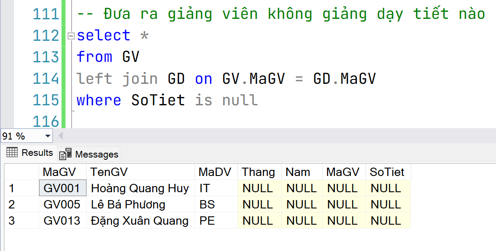

**QUANLYGIANGDAY**
- GV(**MaGV,** TenGV, MaDV)
- DV(**MaDV,** TenDV, DT)
- GD(**Thang, Nam, MaGV,** SoTiet)

**Kịch bản**
- Giảng viên GV001, GV005, GV013 không dạy tiết nào cả
- Coi dữ liệu được lấy bắt đầu từ tháng 12/2022
- Giảng viên GV007 và GV008 **hàng tháng** đều có số tiết <=60
- Giảng viên GV009 và GV010 **cả** hai tháng 3 và 4 năm 2023 **đều có** số tiết trên 300, nhưng GV011 chỉ có tháng 4 có số tiết trên 300
- Trừ giảng viên GV010, tất cả giảng viên đều có ít nhất 1 tháng có số tiết <= 60


# Ôn tập
## Đưa ra giảng viên không dạy tiết nào
```sql
-- Đưa ra giảng viên không giảng dạy tiết nào
select * 
from GV
left join GD on GV.MaGV = GD.MaGV
where SoTiet is null
```

left join sẽ giữ toàn bộ thuộc tính bảng ban đầu (bảng GV) và nối đến bảng GD

left join sẽ giữ lại toàn bộ bản ghi ở bảng ban đầu (GV), những bản ghi không liên kết được nó sẽ báo null



## Đưa ra thông tin đơn vị có giảng viên dạy số tiết tháng 3 và tháng 4 năm 2023 đều lớn hơn 300 (>300)
```sql
-- Đưa ra thông tin đơn vị có giảng viên dạy số tiết tháng 3 và tháng 4 năm 2023 đều lớn hơn 300 (>300)
select * 
from DV
where MaDV in (
	select GV.MaDV
	from DV
	left join GV on GV.MaDV = DV.MaDV
	left join GD on GV.MaGV = GD.MaGV
	where Nam = 2023 and Thang = 3 and SoTiet > 300
	intersect
	select GV.MaDV
	from DV
	left join GV on GV.MaDV = DV.MaDV
	left join GD on GV.MaGV = GD.MaGV
	where Nam = 2023 and Thang = 4 and SoTiet > 300
)
-- Chú ý lúc giao thì chỉ dùng thuộc tính mã, nếu không sẽ nhận về bảng rỗng
```

## Đưa ra thông tin giảng viên hàng tháng đều có số tiết dưới 60 (<60)
```sql
-- Đưa ra thông tin giảng viên hàng tháng đều có số tiết dưới 60 (<60)
select GV.MaGV, TenGV
from GV
left join GD on GV.MaGV = GD.MaGV
group by GV.MaGV, TenGV
having max(SoTiet) < 60
```

Lưu ý tránh lỗi, trên select có gì thì dưới group có cái nấy, ví dụ như code dưới đây là **sai**!!
```sql
-- Đưa ra thông tin giảng viên hàng tháng đều có số tiết dưới 60 (<60)
select GV.* 
from GV
left join GD on GV.MaGV = GD.MaGV
group by GV.MaGV
having max(SoTiet) < 60
```