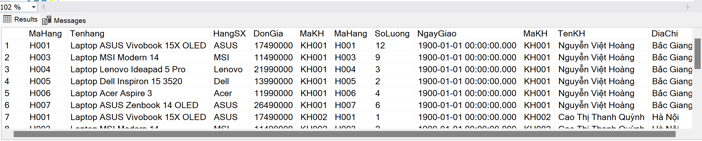
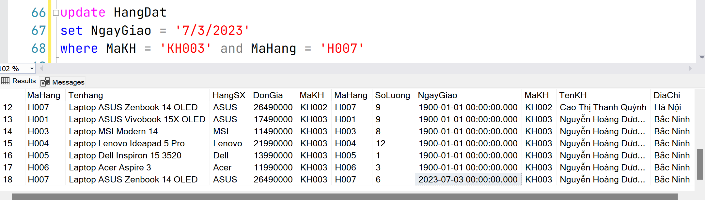

**QuanLyBanHang**
- KhachHang(**MaKH,** TenKH, DiaChi)
- Hang(**MaHang,** TenHang, HangSX, DonGia)
- HangDat(**MaKH, MaHang,** SoLuong, NgayGiao)


Kịch bản:
- Mã hàng H002 không có khách hàng nào đặt mua
- H001, H003, H006, H007 là những mã hàng có ít nhất 3 khách hàng đặt mua

# Lý thuyết
## Nhập vào dữ liệu với kiểu dữ liệu là chuỗi
Kiểu này nhập trong cặp ngoặc đơn hay ngoài nó đều không báo lỗi, nhưng nhập không để trong cặp ngoặc đơn nó sẽ bị lỗi như sau đây:



Cần để vào trong cặp ngoặc đơn để không bị lỗi, và thứ tự nhập vào là: tháng/ngày/năm


Để so sánh thì ta dùng dấu bằng

## Xoá 1 bản ghi
Xoá bản ghi có MaKH = 'KH003' và MaHang = 'H004' của bảng HangDat
```sql
delete from HangDat where MaKH = 'KH003' and MaHang = 'H004';
```

## Quan hệ giữa SELECT VÀ GROUP BY là gì?
Cái gì có trong SELECT (trừ các hàm) thì **bắt buộc** phải có trong GROUP BY

Nhưng cái gì có trong GROUP BY thì có thể **có hoặc không** có ở trong SELECT

Ví dụ lỗi:
```sql
select Hang.TenHang, sum(SoLuong)
from Hang
left join HangDat on HangDat.MaHang = Hang.MaHang
group by HangDat.MaHang
having sum(SoLuong) = (
	select max(SoLuong_VirtualField) 
	from (
		select sum(SoLuong) as SoLuong_VirtualField
		from HangDat
		group by MaHang
	) as SoLuong_VirtualTable
)
```

Fix:
```sql
select Hang.TenHang, sum(SoLuong)
from Hang
left join HangDat on HangDat.MaHang = Hang.MaHang
group by HangDat.MaHang, Hang.TenHang
having sum(SoLuong) = (
	select max(SoLuong_VirtualField) 
	from (
		select sum(SoLuong) as SoLuong_VirtualField
		from HangDat
		group by MaHang
	) as SoLuong_VirtualTable
)
```


---
# Ôn tập
## Hiển thị số lượng hàng lớn nhất mà khách hàng KH001 đặt
```sql
select max(SoLuong)
from HangDat
where MaKH = 'KH001'
```

## Số lượng đặt hàng lớn nhất, nhỏ nhất, trung bình của mặt hàng 'Laptop ASUS Zenbook 14 OLED' do hãng 'ASUS' sản xuất
```sql
-- Số lượng đặt hàng lớn nhất, nhỏ nhất, trung bình của mặt hàng 'Laptop ASUS Zenbook 14 OLED' do hãng 'ASUS' sản xuất
select max(SoLuong) 'Max', min(SoLuong) 'Min', avg(SoLuong) 'Avg'
from HangDat
left join Hang on Hang.MaHang = HangDat.MaHang
where Hang.TenHang = 'Laptop ASUS Zenbook 14 OLED' and Hang.HangSX = 'ASUS'
```

## Mã hàng, tên hàng, tổng số lượng hàng được khách đặt
```sql
select HangDat.MaHang, Hang.TenHang, sum(HangDat.SoLuong)
from HangDat
left join Hang on HangDat.MaHang = Hang.MaHang
group by HangDat.MaHang, Hang.TenHang
```


## Mã hàng có số lượng đặt hàng nhỏ nhất không sử dụng sort

Ta chia thành các bước nhỏ:
- Vì from nhận các bảng, ta sẽ đi tạo 1 bảng ảo lưu 1 danh sách các tổng số lượng đặt
- Tạo bảng ảo:
  - Viết cú pháp tính tổng mặt hàng nhóm theo MaHang, đặt bí danh cho tên trường của bảng ảo để chút dùng đến
  - Tạo bí danh cho bảng ảo để from có thể tham chiếu
- Viết cú pháp select, đến đây ta thu được min
```sql
select min(TongSoLuongDatHang) 
from(
	select MaHang, sum(SoLuong) as TongSoLuongDatHang
    -- Đặt tên bí danh cho virtual field
	from HangDat
	group by MaHang
	) as TongSoLuongDatHangTable;
    -- Đặt tên cho virtual table
```
- Viết câu lệnh select bên ngoài để hoàn tất 
```sql
select MaHang, sum(SoLuong)
from HangDat
group by MaHang
having sum(SoLuong) = (
	select min(SoLuong_VirtualField) 
	from(
		select sum(SoLuong) as SoLuong_VirtualField
		from HangDat
		group by MaHang
	) as SoLuong_VirtualTable
);
```

**Step by step solution:**

B1: Tạo Virtural Field lưu dãy tổng số lượng bán được theo nhóm MaHang
```sql
select sum(SoLuong) as SoLuong_VirtualField
from HangDat
group by MaHang
```

B2: Tạo Virtual Table để phục vụ cho FROM, dùng FROM để lấy ra min
```sql
select min(SoLuong_VirtualField) 
from(
	select sum(SoLuong) as SoLuong_VirtualField
	from HangDat
	group by MaHang
) as SoLuong_VirtualTable;
```

B3: Final
```sql
select MaHang, sum(SoLuong)
from HangDat
group by MaHang
having sum(SoLuong) = (
	select min(SoLuong_VirtualField) 
	from(
		select sum(SoLuong) as SoLuong_VirtualField
		from HangDat
		group by MaHang
	) as SoLuong_VirtualTable
);
```

## Mã hàng có số lượng đặt hàng nhỏ nhất sử dụng 2 tầng truy vấn
```sql
select MaHang, sum(SoLuong)
from HangDat
group by MaHang
having sum(SoLuong) <= all(select sum(SoLuong) from HangDat group by MaHang)
```

## Tên mặt hàng ít nhất 3 khách hàng mua
```sql
-- Tên mặt hàng ít nhất 3 khách hàng mua
select HangDat.MaHang, TenHang, count(MaKH)
from Hang
inner join HangDat on HangDat.MaHang = Hang.MaHang
group by HangDat.MaHang, TenHang
having count(MaKH) >= 3
```


## Tên hàng được mua nhiều nhất
```sql
select Hang.TenHang, sum(SoLuong)
from Hang
left join HangDat on HangDat.MaHang = Hang.MaHang
group by HangDat.MaHang, Hang.TenHang
having sum(SoLuong) = (
	select max(SoLuong_VirtualField) 
	from (
		select sum(SoLuong) as SoLuong_VirtualField
		from HangDat
		group by MaHang
	) as SoLuong_VirtualTable
)
```

## Tìm mã và tên hàng không có khách hàng nào mua
left join sẽ giữ lại tất cả các trường bên gốc, vậy nên chỉ cần nối đến bảng kia, xác định trường null rồi kiểm tra là ra, ta hoàn toàn có thể thay HangDat.SoLuong thành HangDat.NgayGiao, chúng đều là null sau khi nối bảng
```sql
-- Mã hàng và tên hàng không được khách hàng nào mua
select Hang.MaHang, Hang.TenHang
from Hang
left join HangDat on Hang.MaHang = HangDat.MaHang
where HangDat.SoLuong is null
```

